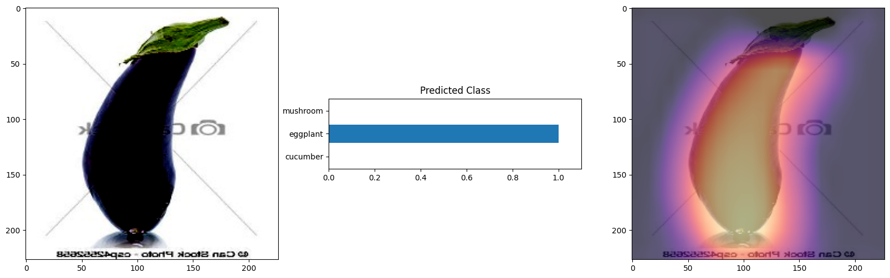

# GradCAM in PyTorch
This repository provides an implementation of GradCAM (Gradient-weighted Class Activation Mapping) in PyTorch. GradCAM is a technique that enables the visualization of important regions in an input image that contribute to the classification decision of a deep learning model.

## What is GradCAM?
GradCAM is a visualization technique that helps in understanding the reasoning behind the predictions made by deep learning models. It generates a heatmap that highlights the regions of an input image that are most influential in the model's decision-making process. By visualizing these important regions, we can gain insights into what the model is focusing on to make its predictions, thus providing explainability to the AI system.

## Results

  
  
  

